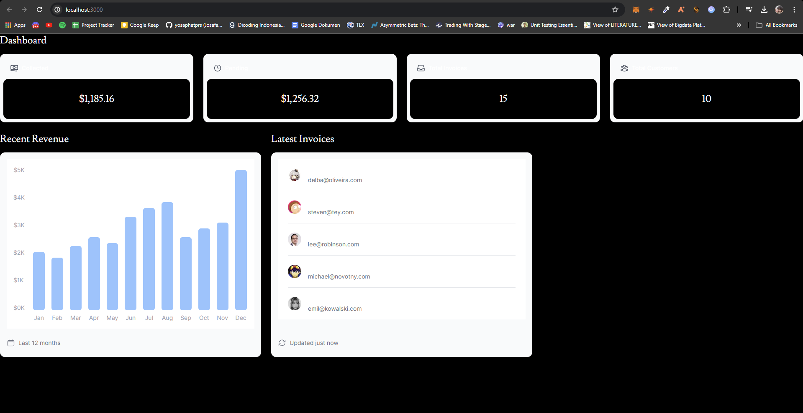

## Laporan Praktikum

|  | Pemrograman Berbasis Framework 2024 |
|--|--|
| NIM |  2141720031 |
| Nama |  Josafat Pratama Susilo |
| Kelas | TI - 3A |

### Praktikum 1

### Soal 1

Capture hasil deploy project Anda dan buatlah laporan di file README.md. Jelaskan apa yang telah Anda pelajari?

Jangan lupa push dengan pesan commit: "W09: Jawaban soal 1".

### Jawaban Soal 1

Hasil:


Yang telah saya pelajari adalah bagaimana cara melakukan deployment project ke vercel melalui repository GitHub. 

### Soal 2

Capture hasil basis data Anda dan buatlah laporan di file README.md. Jelaskan apa yang telah Anda pelajari?

Jangan lupa push dengan pesan commit: "W09: Jawaban soal 2".

### Jawaban Soal 2

Hasil:


Yang telah saya pelajari adalah bagaimana cara membuat database PostgreSQL pada vercel, dan pentingnya penggunaan gitignore untuk tidak mengikutsertakan file yang tidak perlu di push ke repository. Saya juga mempelajari bahwa dengan meletakkan lokasi database dalam satu region yang sama atau semakin dekat dengan lokasi source code dideploy, maka dapat mengurangi latency pada tiap request data.

### Soal 3

Capture hasil npm run seed Anda dan buatlah laporan di file README.md. Jelaskan apa yang telah Anda pelajari ?

Jangan lupa push dengan pesan commit: "W09: Jawaban soal 3".

### Jawaban Soal 3

Hasil:


Hal yang telah saya pelajari adalah bagaimana cara melakukan seeder menggunakan vercel/postgres.

### Soal 4

Capture hasil query Anda dan buatlah laporan di file README.md. Jelaskan apa yang telah Anda pelajari ? Cobalah eksekusi query SQL yang lain sesuai kreasi Anda, capture hasilnya dan jelaskan!

Jangan lupa push dengan pesan commit: "W09: Jawaban soal 4".

### Jawaban Soal 4

Hasil:


Saya mempelajari bagaimana menjalankan SQL query pada database PostgreSQL yang telah saya buat. Saya juga mencoba membuat query SQL yang lain, yaitu menampilkan user, total transaksi dan tanggal transaksi yang telah melakukan transaksi dengan total transaksi lebih dari 10000 serta memiliki status telah terbayar (paid), dengan hasil sebagai berikut:


### Soal 5

Lakukan push, kemudian perhatikan di akun dashboard Vercel project Anda. Capture dan lampirkan link aplikasi Anda yang telah berhasil di deploy, kemudian buatlah laporan di file README.md. Jelaskan apa yang telah Anda pelajari ?

Jangan lupa push dengan pesan commit: "W09: Jawaban soal 5".

### Jawaban Soal 5

Hasil:


Link: https://nextjs-dashboard-yosaphatprs-projects.vercel.app/ 

Yang telah saya pelajari adalah bagaimana cara membuat model dari fetching data.

### Soal 6

Hasil:


Saya mengubah tampilan chart menjadi lebih baik yang sebelumnya bar bulan desember berada di bawah sehingga tampil normal.

### Soal 7

Hasil:


### Tugas Praktikum

1. Jika Anda perhatikan pada file src\app\page.tsx untuk komponen Card sebenarnya telah dibuat sebagai molecules pada file src\app\components\molecules\card.tsx yaitu komponen CardWrapper. Silakan Anda sesuaikan sehingga dapat tampil seperti gambar berikut.

    Hasil: 

    

    Saya menambahkan kode 
    ```const card = await fetchCardData();``` pada file src\app\page.tsx, kemudian menyesuaikan kode pada file tersebut sehingga value dapat diambil dari variabel card pada setiap komponen atom Card.


2. Perhatikan fungsi fetchCardData() (pada file src\model\query.tsx) dari soal nomor 1. Jelaskan maksud kode dan kueri yang dilakukan dalam fungsi tersebut!

    Berikut adalah isi dari fungsi fetchCardData():

    ```tsx
    export async function fetchCardData() {
        noStore();
        try {
            // You can probably combine these into a single SQL query
            // However, we are intentionally splitting them to demonstrate
            // how to initialize multiple queries in parallel with JS.
            const invoiceCountPromise = sql`SELECT COUNT(*) FROM invoices`;
            const customerCountPromise = sql`SELECT COUNT(*) FROM customers`;
            const invoiceStatusPromise = sql`SELECT
            SUM(CASE WHEN status = 'paid' THEN amount ELSE 0 END) AS "paid",
            SUM(CASE WHEN status = 'pending' THEN amount ELSE 0 END) AS "pending"
            FROM invoices`;

            const data = await Promise.all([
                invoiceCountPromise,
                customerCountPromise,
                invoiceStatusPromise,
            ]);

            const numberOfInvoices = Number(data[0].rows[0].count ?? '0');
            const numberOfCustomers = Number(data[1].rows[0].count ?? '0');
            const totalPaidInvoices = formatCurrency(data[2].rows[0].paid ?? '0');
            const totalPendingInvoices = formatCurrency(data[2].rows[0].pending ?? '0');

            return {
                numberOfCustomers,
                numberOfInvoices,
                totalPaidInvoices,
                totalPendingInvoices,
            };
        } catch (error) {
            console.error('Database Error:', error);
            throw new Error('Failed to fetch card data.');
        }
    }
    ```

    Pertama, akan dipanggil fungsi noStore() yang berfungsi untuk menghapus data yang ada pada cache. Karena pada dasarnya, NextJs akan melakukan caching secara lokal pada setiap pemanggilan API. Sehingga terkadang data yang diambil tidak sesuai dengan data yang ada pada database karena NextJs hanya akan me-return data dari cache. Dengan pemanggilan fungsi noStore(), maka data yang ada pada cache akan dihapus dan data yang diambil akan selalu fresh dari database. Hal ini mirip dengan menambahkan cache: 'no-store' atau { next: { revalidate: 0 }} dalam fetch API di Next.js saat melakukan fetching dengan data dinamis.

    Lalu akan melakukan try pada block code dalam try, jika terjadi error maka akan di-handle oleh catch block.

    Kemudian dalam try terdapat 3 query yang akan dijalankan secara parallel, yaitu:
    1. Menghitung jumlah invoice yang ada pada database. (invoiceCountPromise)
    2. Menghitung jumlah customer yang ada pada database. (customerCountPromise)
    3. Menghitung total amount dari invoice yang telah dibayar dan yang belum dibayar. (invoiceStatusPromise)
    
    Selanjutnya, akan diambil data dari hasil query yang telah dijalankan, dan dimasukkan ke dalam variabel yang sesuai.

    Setelah itu data tadi akan di return dalam bentuk object yang berisi jumlah customer, jumlah invoice, total amount invoice yang telah dibayar, dan total amount invoice yang belum dibayar.