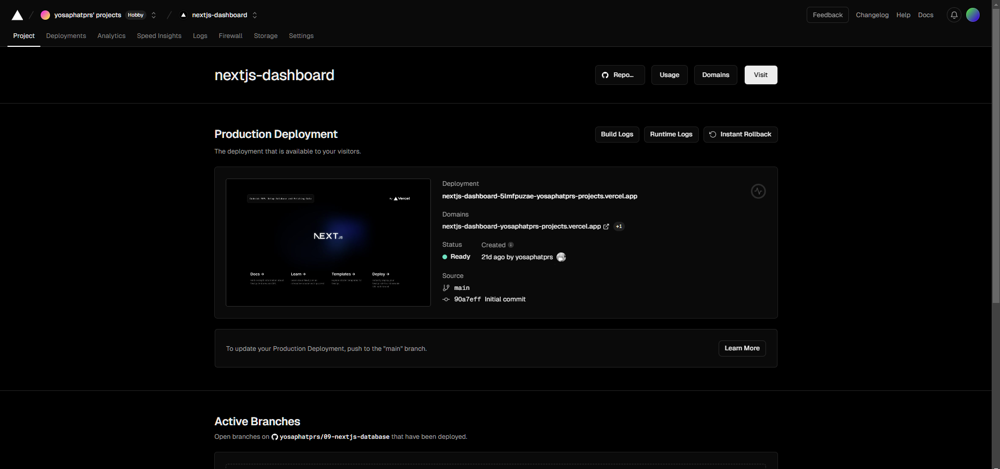
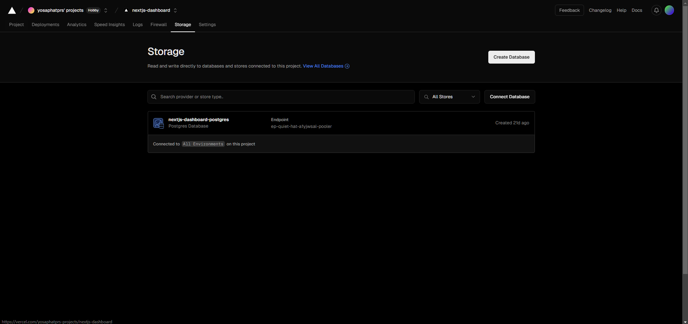
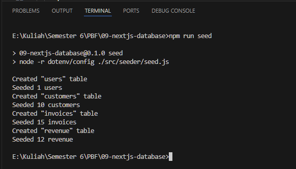
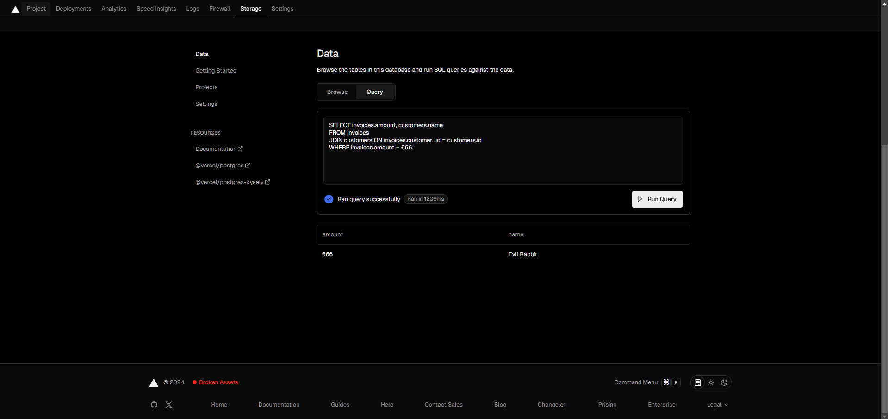
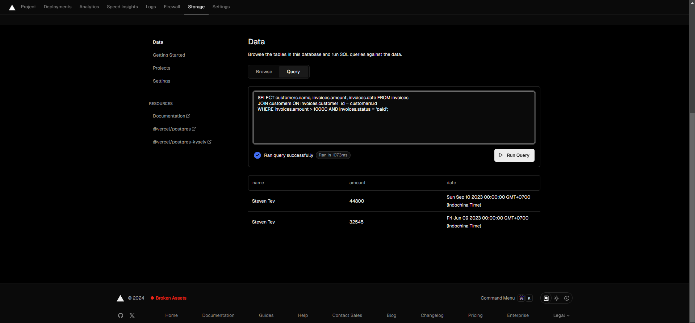
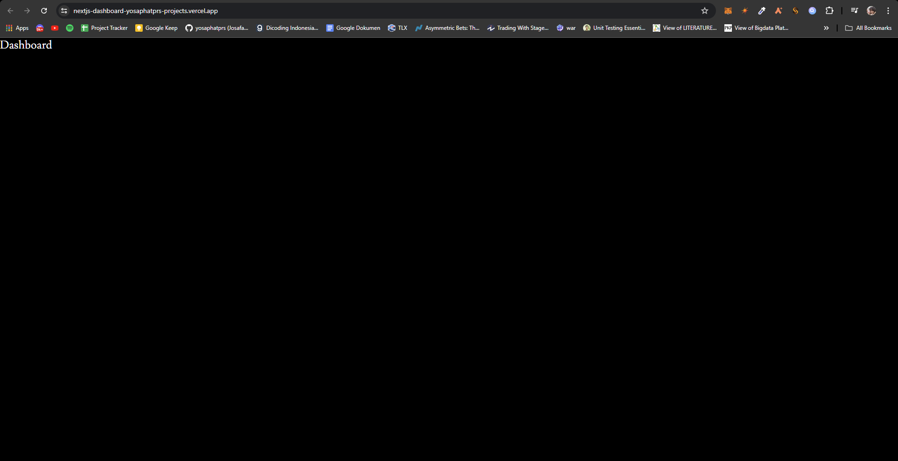
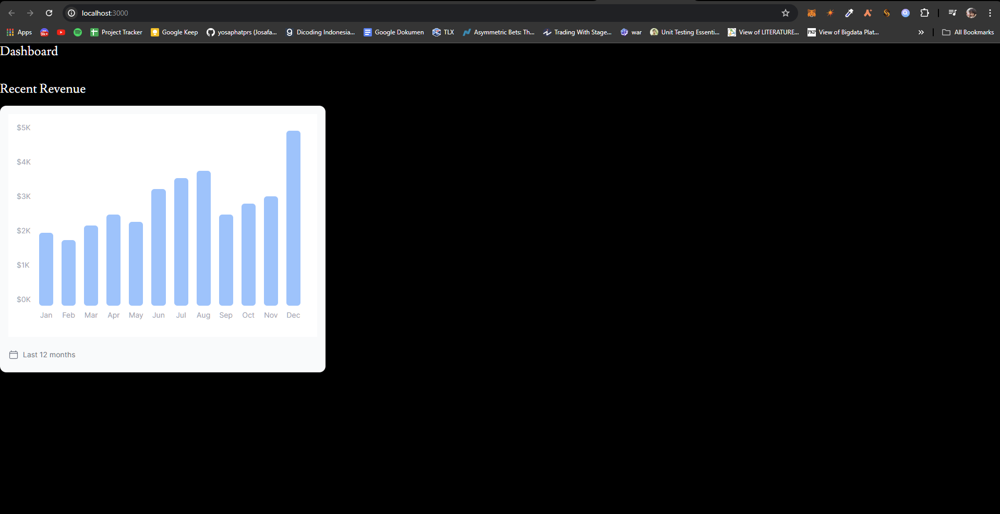
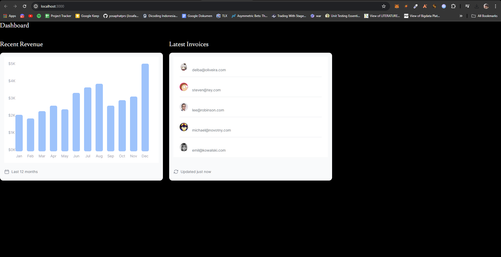

## Laporan Praktikum

|  | Pemrograman Berbasis Framework 2024 |
|--|--|
| NIM |  2141720031 |
| Nama |  Josafat Pratama Susilo |
| Kelas | TI - 3A |

### Praktikum 1

### Soal 1

Capture hasil deploy project Anda dan buatlah laporan di file README.md. Jelaskan apa yang telah Anda pelajari?

Jangan lupa push dengan pesan commit: "W09: Jawaban soal 1".

### Jawaban Soal 1

Hasil:

Yang telah saya pelajari adalah bagaimana cara melakukan deployment project ke vercel melalui repository GitHub. 

### Soal 2

Capture hasil basis data Anda dan buatlah laporan di file README.md. Jelaskan apa yang telah Anda pelajari?

Jangan lupa push dengan pesan commit: "W09: Jawaban soal 2".

### Jawaban Soal 2

Hasil:

Yang telah saya pelajari adalah bagaimana cara membuat database PostgreSQL pada vercel, dan pentingnya penggunaan gitignore untuk tidak mengikutsertakan file yang tidak perlu di push ke repository. Saya juga mempelajari bahwa dengan meletakkan lokasi database dalam satu region yang sama atau semakin dekat dengan lokasi source code dideploy, maka dapat mengurangi latency pada tiap request data.

### Soal 3

Capture hasil npm run seed Anda dan buatlah laporan di file README.md. Jelaskan apa yang telah Anda pelajari ?

Jangan lupa push dengan pesan commit: "W09: Jawaban soal 3".

### Jawaban Soal 3

Hasil:

Hal yang telah saya pelajari adalah bagaimana cara melakukan seeder menggunakan vercel/postgres.

### Soal 4

Capture hasil query Anda dan buatlah laporan di file README.md. Jelaskan apa yang telah Anda pelajari ? Cobalah eksekusi query SQL yang lain sesuai kreasi Anda, capture hasilnya dan jelaskan!

Jangan lupa push dengan pesan commit: "W09: Jawaban soal 4".

### Jawaban Soal 4

Hasil:

Saya mempelajari bagaimana menjalankan SQL query pada database PostgreSQL yang telah saya buat. Saya juga mencoba membuat query SQL yang lain, yaitu menampilkan user, total transaksi dan tanggal transaksi yang telah melakukan transaksi dengan total transaksi lebih dari 10000 serta memiliki status telah terbayar (paid), dengan hasil sebagai berikut:

### Soal 5

Lakukan push, kemudian perhatikan di akun dashboard Vercel project Anda. Capture dan lampirkan link aplikasi Anda yang telah berhasil di deploy, kemudian buatlah laporan di file README.md. Jelaskan apa yang telah Anda pelajari ?

Jangan lupa push dengan pesan commit: "W09: Jawaban soal 5".

### Jawaban Soal 5

Hasil:

Link: https://nextjs-dashboard-yosaphatprs-projects.vercel.app/ 

Yang telah saya pelajari adalah bagaimana cara membuat model dari fetching data.

### Soal 6

Hasil:

Saya mengubah tampilan chart menjadi lebih baik yang sebelumnya bar bulan desember berada di bawah sehingga tampil normal.

### Soal 7

Hasil:

